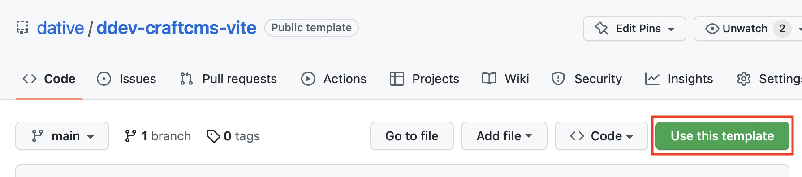

# ddev-craftcms-vite

This repository is a template for [DDEV](https://ddev.readthedocs.io/en/stable/) + [CraftCMS](https://craftcms.com/docs/4.x/) + [Vite](https://vitejs.dev) project for local development.

This implementation makes heavy use of default and added DDEV environment variables to configure the project. The following environment variables are used:

- `DDEV_PRIMARY_URL`: used both on `vite.config.ts` and `./cms/.env` to configure the CraftCMS `PRIMARY_SITE_URL` and in Vite's `server` configuration.
- `DDEV_PROJECT`: used to configure the CraftCMS `PRIMARY_SITE_NAME`
- `VITE_PRIMARY_PORT`: used to configure the port on Vite's `server`  and Vite Craft Plugin on `./cms/config/vite.php`

## Components of the repository

- The base setup to run CraftCMS + Vite with DDEV
- [Github actions](https://github.com/dative/ddev-craftcms-vite/blob/main/.github/workflows/build-and-deploy.yml) for building an deploying the site in Forge.

### The Project:

The project is based on [Craft CMS](https://craftcms.com) using the `templates/_boilerplate` system for web/AJAX pages from [nystudio107/craft](https://github.com/nystudio107/craft) starter, and implements a number of technologies/techniques:

- Leverages DDEV for both PHP and Node development environments.
- A base Twig templating setup as described in [An Effective Twig Base Templating Setup](https://nystudio107.com/blog/an-effective-twig-base-templating-setup), with some minor modifications.
- [Vite](https://vitejs.dev) is used for the build system.
- [TypeScript](https://www.typescriptlang.org/) for strictly typed JavaScript code.
- [TailwindCSS](https://tailwindcss.com/) for the site-wide CSS.
- Static assets are stored in Digital Ocean Spaces.
- Critical CSS using the [rollup-plugin-critical](https://github.com/nystudio107/rollup-plugin-critical)
- Frontend error handling as per [Handling Errors Gracefully in Craft CMS](https://nystudio107.com/blog/handling-errors-gracefully-in-craft-cms).
- [Github Actions](https://github.com/features/actions) for atomic deployments.

...and a bunch of other stuff too.

The following Craft CMS plugins are used on this site:

- [Mailgun](https://github.com/craftcms/mailgun)
- [Redactor](https://github.com/craftcms/redactor)
- [BlurHash](https://github.com/dodecastudio/craft-blurhash)
- [Vite](https://github.com/nystudio107/craft-vite)
- [Empty Coalesce](https://github.com/nystudio107/craft-emptycoalesce)
- [Retour](https://github.com/nystudio107/craft-retour)
- [SEOmatic](https://github.com/nystudio107/craft-seomatic)
- [Typogrify](https://github.com/nystudio107/craft-typogrify)
- [Minify](https://github.com/nystudio107/craft-minify)
- [Relax](https://github.com/ostark/craft-relax)
- [Typed Link Field](https://github.com/sebastian-lenz/craft-linkfield)
- [DigitalOcean Spaces Volume](https://github.com/vaersaagod/dospaces)
- [Navigation](https://github.com/verbb/navigation)
- [Super Table](https://github.com/verbb/super-table)

The DDEV is configured with `PHP 8.1`, `MySQL 8.0` and `Node 16`.

## Requirements

DDEV installed and running on your machine. [Installation instructions](https://ddev.readthedocs.io/en/stable/#installation)

## Getting Started

You can create a new repo from this one by clicking the template button in the top right corner of the page.

After creating your new repo and cloning it locally:

1. Create the new template repository by using the template button.
2. Clone the new repository to your local machine.
3. Replace `craft-vite` in `.ddev/confi.yaml` with your local project name.
4. Start DDEV with `ddev start`.
5. Run `ddev install-craft` to install CraftCMS.

The [`ddev install-craft`](https://github.com/dative/ddev-craftcms-vite/blob/main/.ddev/commands/web/install-craft) command will perform the following actions:

- Copy the `env.example` file to `.env`, if it doesn't exist.
- Create the `storage` directory, if it doesn't exist.
- Setup Craft's `CRAFT_APP_ID`, `CRAFT_SECURITY_KEY` and setup the database with DDEV's default configuration.
- Install CraftCMS with all defaults plus:
  - Email: `info@hellodative.com`
  - Password: `changeme`.
  - Site name: `$PRIMARY_SITE_NAME`
  - Site URL: `$PRIMARY_SITE_URL`
- Perform Craft Plugin installs.

## Using dative/ddev-craftcms-vite

Once installed and started, you can run `ddev yarn` to install the node dependencies and `ddev yarn dev` to start the dev server.

Other useful commands:

- `ddev yarn lint`: run the linter.
- `ddev yarn lint:fix`: run the linter and fix the errors.
- `ddev yarn build`: build the production assets.
- `ddev yarn build:critical`: build the production assets for CI. It uses `CRITICAL_URL` env variable to generate the critical CSS.

And the Craft/DDEV commands:

- `ddev install-craft`: run the installer.
- `ddev craft`: run the Craft CLI.

## Roadmap

- [ ] Auto detect either the fork repository name or the local directory name, and pipe as DDEV project name.

## Thanks

Big thanks to Andrew Welch for his awesome [plugins](https://nystudio107.com/plugins) and [articles](https://nystudio107.com/blog) from which this repository is heavily based on.

Brought to you by [Dative](https://hellodative.com)